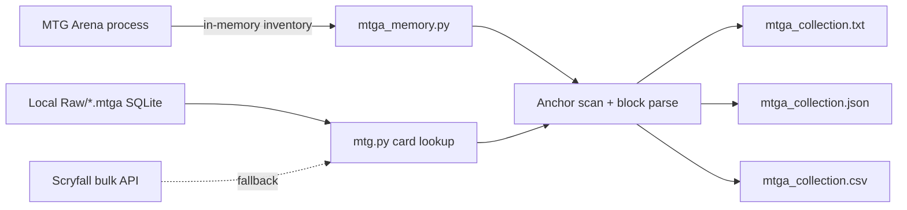

# Technical Specification — MTGA Collection Exporter (macOS)

## Overview

macOS CLI tool that exports a player's MTG Arena collection by scanning in-memory inventory data while the game is running, resolving Arena card IDs through local SQLite catalogs or Scryfall.

## Problem statement

MTG Arena does not expose a portable collection export on macOS. Existing community tools target Windows memory APIs. Players on Mac need the same txt/json/csv outputs for deck builders and collection tracking.

## Solution summary

- Read card metadata from `~/Library/Application Support/com.wizards.mtga/Downloads/Raw/*.mtga`
- Connect to the `MTGA` process via Mach task ports (`pymem-osx`)
- Locate collection arrays using user-provided anchor cards (grpId + quantity pairs)
- Emit txt, json, and Moxfield csv exports

## Architecture

### Components

| Component | Responsibility |
|-----------|----------------|
| `mtg.py` | Card DB loading, anchor prompts, export writers |
| `mtga_memory.py` | Platform memory attach + pattern scan |
| `install.sh` | macOS venv bootstrap |
| `Formula/` | Homebrew packaging |

## Tech stack

| Layer | Technology |
|-------|------------|
| Runtime | Python 3.10+ |
| macOS memory | pymem-osx (Mach VM APIs) |
| Card metadata | MTGA local SQLite + Scryfall bulk |
| Packaging | Homebrew formula, optional PyInstaller |

## Interfaces

### APIs / entry points

- CLI: `python mtg.py`
- Homebrew: `mtga-export` (after formula install)

### Configuration

- `last_anchors.json` — saved anchor cards between runs
- `arena_id_lookup.json` — cached grpId → name map

## Data and persistence

- **Inputs:** live MTGA process memory, local `.mtga` SQLite catalogs
- **Outputs:** `mtga_collection.{txt,json,csv}` in script directory
- **Cache:** JSON lookup file (regenerable)

## Deployment

- **Target:** macOS 12+ (Apple Silicon primary)
- **Build:** `./install.sh` or `brew install jv-darkheartlabs/tap/mtga-collection-exporter-mac`
- **Run:** `python mtg.py` (sudo if task_for_pid denied)
- **Health:** manual — successful export files written

## Testing strategy

| Layer | Command | Coverage |
|-------|---------|----------|
| Unit | `python -m compileall mtg.py mtga_memory.py` | Syntax/import smoke |
| Integration | Manual with MTGA running | End-to-end export |

Automated memory tests are not CI-friendly without a live game process.

## Security and reliability notes

- Read-only memory access; no game modification
- Requires elevated privileges on macOS (`task_for_pid`)
- Scryfall fallback downloads large bulk JSON (~200MB+)
- Not affiliated with Wizards of the Coast

## Evidence map (reviewer paths)

| Concern | Path |
|---------|------|
| macOS MTGA data path | `mtg.py` → `get_local_mtga_path()` |
| Memory backend | `mtga_memory.py` |
| Export formats | `mtg.py` → `main()` writers |
| macOS install | `install.sh` |
| Packaging | `Formula/mtga-collection-exporter-mac.rb` |

## Architecture decisions

See `docs/adr/`. Key records:

- `0001-record-architecture-decisions.md` — ADR process
- `0002-macos-memory-backend.md` — pymem-osx vs standard pymem

---

**Maintained by:** [Dark Heart Labs](https://darkheartlabs.technology)  
**Author:** Jennifer ([@jv-darkheartlabs](https://github.com/jv-darkheartlabs))  
**Site:** https://darkheartlabs.technology
